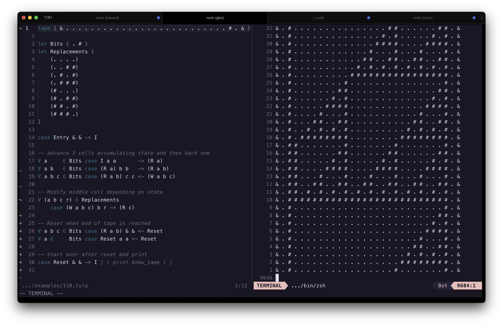
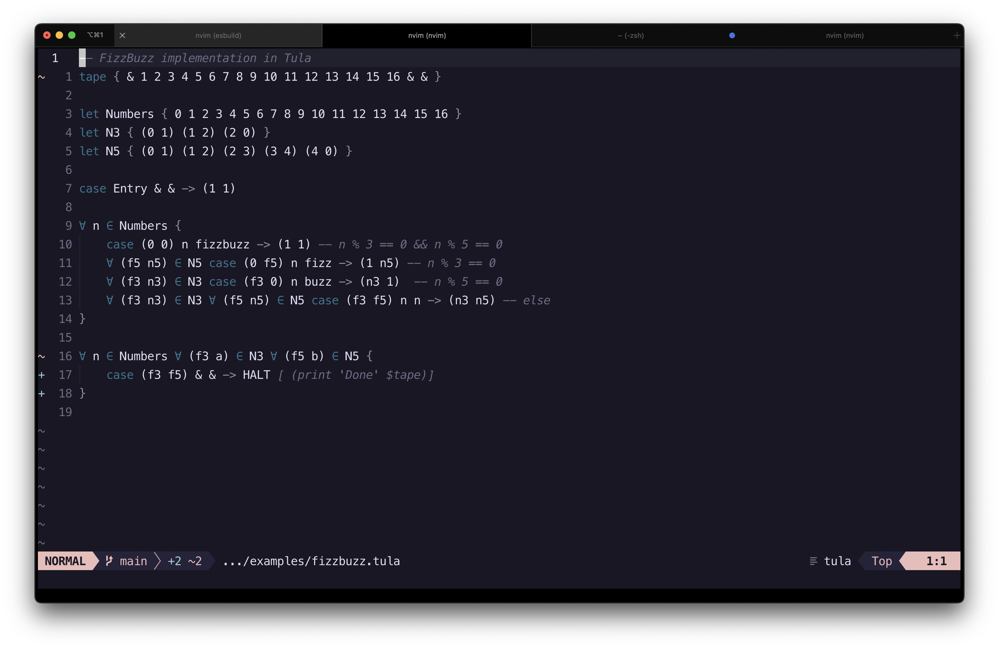

# Tula
**Tu**ring **La**nguage. A programming language for describing turing machines in a concise way.

This is an Haskell Implementation of Tula from **the great Tsoding**. See the original repo [Tula](https://github.com/tsoding/tula)

This is Tsoding's idea and all Credit goes to him.
Except for the implementation in Haskell which is mine.



## Examples
See all examples in the `examples/` folder

## Base Syntax
In its most basic form it concists of turing 5-tuple cases.
```
case <State> <Read> <Write> <Step> <NextState>
```

### Example
```hs
-- Tape the machine will operate oncon
tape { 1 1 0 1 & }

-- if State is Inc and Read a 0, write a 1, move to right and go to state Halt
case Inc 0 1 -> Halt

case Inc 1 0 -> Inc

```
Using Haskell syntax highlighting because it's the most similar.
Assuming it's called `inc.tape` You can run it like so
```bash
tula trace Inc
```
And it will produce the output
```
Inc: 1 1 0 1
     ^
Inc: 0 1 0 1
       ^
Inc: 0 0 0 1
         ^
Halt: 0 0 1 1
```

### Sets 
Allows you to define a Set of symbols that can be used in Universal Quantification
```hs
-- Set Definition
-- Syntax: let <SetName> { Values... }
let Bits { 0 1 }
```

### Universal Quantification (for in)
```hs
-- Syntax: for <bindings> in <sources> {<case> | <block>}
for a b in Bits case S a b -> S

-- is Equivalent to
for a in Bits {
    for b in Bits {
        case A a b -> A
    }
}
-- And generates the following rules in no particular order
-- case A 0 0 -> A
-- case A 1 0 -> A
-- case A 0 1 -> A
-- case A 1 1 -> A
```

### S-Expressions
To take advantage of the variables defined through Universal Quantification you can use S-Expressions
to create new Symbols. See the following Example

```hs
tape { & (0 1) (2 3) (3 4) & }

let Numbers { 0 1 2 3 4 }

case Entry & & -> Swap

for a b in Numbers case Swap (a b) (b a) -> Swap
```
here the read and write symbols are defined as S-Expressions that take the vars a and b

Output:
```
Entry: & (0 1) (2 3) (3 4) &   | 
       ^
Swap: & (0 1) (2 3) (3 4) &    | Numbers={0 1 2 3 4}
          ^
Swap: & (1 0) (2 3) (3 4) &    | Numbers={0 1 2 3 4}, a={0}, b={1}
                ^
Swap: & (1 0) (3 2) (3 4) &    | Numbers={0 1 2 3 4}, a={2}, b={3}
                      ^
Swap: & (1 0) (3 2) (4 3) &    | Numbers={0 1 2 3 4}, a={3}, b={4}
```
You can see here, each step alongside the bindings

### Pattern Matching
See the following fizzbuzz implementation in Tula
```hs
tape { & 0 1 2 3 4 5 6 7 8 9 10 11 12 13 14 15 16 }
tape Numbers { 0 1 2 3 4 5 6 7 8 9 10 11 12 13 14 15 16 }

let N3 = { (0 1) (1 2) (2 0) }
let N5 = { (0 1) (1 2) (2 3) (3 4) (4 0) }

-- Initial State advance to ( 1 1 )
-- here the state represent ( (n % 3) (n % 5) )
case Entry & & -> (1 1)

-- bind * is any number
for * in Numbers {

    -- if n % 3 == 0 && n % 5 == 0 then write fizzbuzz
    case (0 0) * fizzbuzz -> (1 1)				

    -- for whatever %3 if n % 5 == 0 then write fizz and advance both
    for (f3 n3) in N3 case (f3 0) * fizz -> (n3 1)

    -- for whatever %5 if n % 3 == 0 then write buzz and advance both
    for (f5 n5) in N5 case (0 f5) * buzz -> (1 n5)

    -- if none of the above match
    --  in state (f3 f5) which we know none of them are 0
    --  keep the same number and
    --  advance to (n3 n5)
    for (f3 n3) in N3 for (f5 n5) in N5
        case (f3 f5) * * -> (n3 n5)
}
```
This implementation uses the sets N3 and N5 that represent all Possible combinations of `(n % 3, (n + 1) % 3)` 
and `(n % 5, (n + 1) % 5)` respectively. And uses pattern matching to extract values from within.


## Running a Tula program
```
tula {run | debug | interactive} path/to/file.tula path/to/tape.tula
or
tula {run | debug | interactive} path/to/tula
notice the second form doesn't require an extension
```
The first argument is the mode which can be one of:

### Trace
Runs the program and prints each step

### Debug
Like trace but requires `<Enter>` to be pressed between evaluations

### Run
Runs the tape without printing anything.
See the `Interpreter Flags` section below to understand how you
can interact with the program in `run` mode

## Interpreter Flags
Interpreter flags are lisp expression that are passed to the interpreter for runtime evaluation.
They don't affect the Turing Machine in anyway and are used for inspection and debug.

example:
```hs
-- Syntax case ...case_args... [ S-expression0 S-expression1 ... ]
-- ie.
case Reset & & -> Inc [ (print 'did reset') (print 'tape is' $new_tape)]

case (0 0) n n -> (1 1) [
    (print fizzbuzz)
    (print 'cell:' $cell)
    (print 'state:' $state)
    (print 'tape:' $tape)
]

case Test a b -> Start [ (Breakpoint (eq a 10)) ]
```

They are only handled when the interpreter runs in `Run` mode

Check [Rule 110 example](examples/110.tula) to see how it's used to print each line


## Tooling
Tula is a work in progress, so far apart from the interpreter that provides 
debugging functionality there's also a tula syntax file for vim. I'll make it available as soon
as the language is finalized




